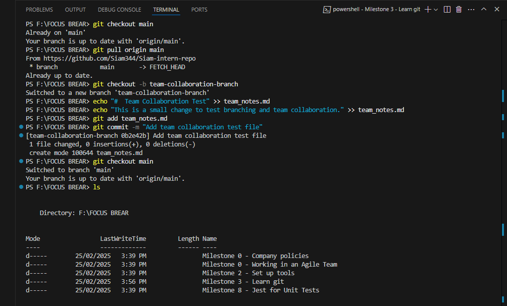

# 🌳 Branching & Team Collaboration

## 📌 Goal
The core idea behind branching is to help teams work on different features, bug fixes, or experiments **without interfering with the main codebase**. It creates a safe space where developers can test changes, collaborate effectively, and avoid conflicts that could break the project.

Branching also ensures that **direct pushes to `main` are avoided**, reducing the chances of unstable code being introduced into the core product. By following a structured review process, teams can improve code quality, encourage peer reviews, and make sure every change is intentional and well-tested before merging.

This process not only keeps the main branch clean and functional but also promotes better teamwork, fewer bugs, and a more scalable workflow — especially as projects and teams grow.

---

## ✅ Tasks

- [ ] **Create a new branch** in your Git desktop client (e.g., GitHub Desktop, VS Code, SourceTree).

- [ ] **Make a small change** in your repo and **commit it** to the new branch.

- [ ] **Switch back to `main`** and **check that your changes are not there**

# 📸 Terminal Screenshot

Here’s a screenshot showing the terminal after creating a new branch and committing changes:

