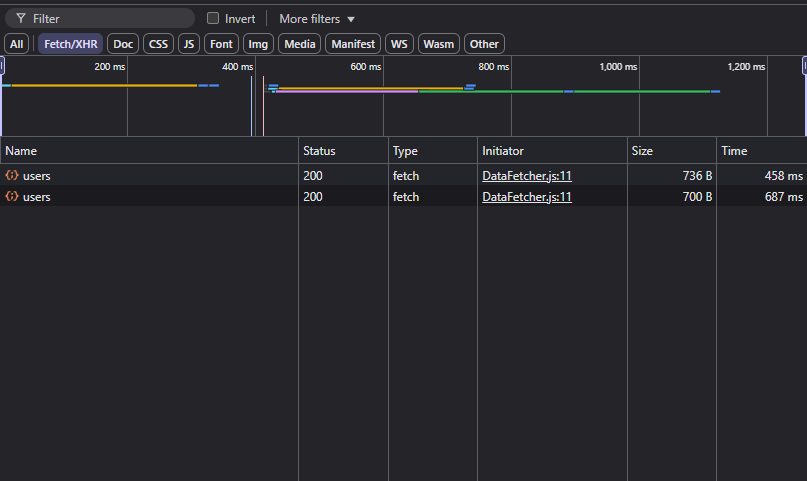

# React Project Reflections

---

## react_fundamentals.md

### 1. Challenges during setup:
- Difficulty configuring Tailwind CSS properly (path issues and missing dependencies).
- Issues understanding initial project setup and dependencies, especially with `node_modules`.

### 2. Why are components important in React?
- Components allow for code reuse, modularity, and maintainability.
- They simplify debugging, as each component can be isolated and tested independently.

### 3. What happens if we modify state directly instead of using setState?
- React won't trigger a re-render.
- State changes won't reflect immediately, causing UI inconsistencies and bugs.

### 4. Advantages and pitfalls of Tailwind CSS:
**Advantages:**
- Rapid development and prototyping.
- Less CSS maintenance.
- Consistent design language.

**Pitfalls:**
- HTML can become cluttered with utility classes.
- Slight learning curve in memorizing classes.

### 5. Common issues when working with lists in React:
- Forgetting unique keys, causing inefficient re-rendering.
- Using indexes as keys, leading to rendering issues when items move or change.
- State mutations directly on arrays instead of creating new ones.

### 6. Advantages of client-side routing:
- Faster, seamless navigation with no full page reloads.
- Enhanced user experience and performance.
- Easy state management across navigation.

---

## react_hooks.md

### 1. useEffect instead of event handlers:
- Use `useEffect` for side-effects that happen on component mount or state changes, such as fetching data.
- Without a dependency array, `useEffect` runs after every render, potentially causing performance issues.
- Improper use can cause infinite loops or excessive re-rendering.

### 2. How does useMemo improve performance?
- `useMemo` caches the result of expensive calculations and recomputes only when dependencies change, avoiding unnecessary computation.

### 3. useCallback vs useMemo:
- `useCallback` solves unnecessary re-renders by memoizing callback functions.
- `useCallback` differs from `useMemo` as it memoizes functions, not values.
- `useCallback` is unnecessary when functions are simple and recreated rarely or when there's no optimization benefit.

### 4. Avoiding useMemo:
- Avoid `useMemo` if the overhead of caching outweighs its benefits.
- Removing `useMemo` causes recalculations on every render, impacting performance if the calculations are heavy.

---

## form_handling.md

### How does Formik simplify form management compared to manual handling?
- Provides built-in validation and error handling.
- Reduces boilerplate by abstracting form state management.
- Enhances maintainability by standardizing form handling logic.

### Benefits of Formik validation vs manual validation:
- Easier to write and read validation logic.
- Automatic management of validation state reduces errors.
- Improves consistency across forms in your app.

---

## i18n.md

### Challenges faced with i18next:
- Understanding the initial setup and configuration complexity.
- Ensuring seamless integration with React components.
- Managing dynamic content translations.

### Importance of i18next vs manual handling:
- Standardizes localization workflows.
- Simplifies maintenance, especially for larger multilingual apps.
- Reduces errors from manual translation management.

### Handling dynamic content (user-generated text) in multilingual apps:
- Use interpolation features provided by i18next.
- Design data structures to include translations or fallback defaults.
- Implement moderation or review for user-generated translations.

---

## api_calls.md

### Why is creating a reusable Axios instance useful?
- Centralizes configuration like headers, authentication tokens, and base URLs.
- Enhances maintainability and consistency across API requests.

### How does intercepting requests help with authentication?
- Automatically adds tokens or credentials to all requests.
- Simplifies handling of authentication errors and token refresh logic.

### Handling API request timeouts:
- A timeout results in a rejected promise.
- Use `.catch()` blocks or async/await error handling to gracefully manage these scenarios, possibly informing users or retrying requests.

---
