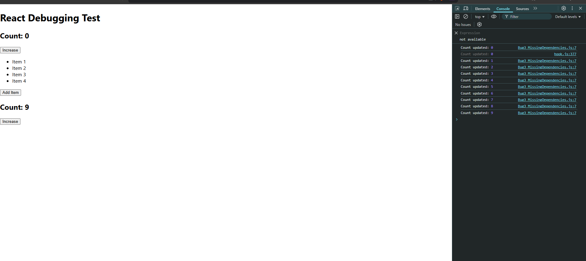
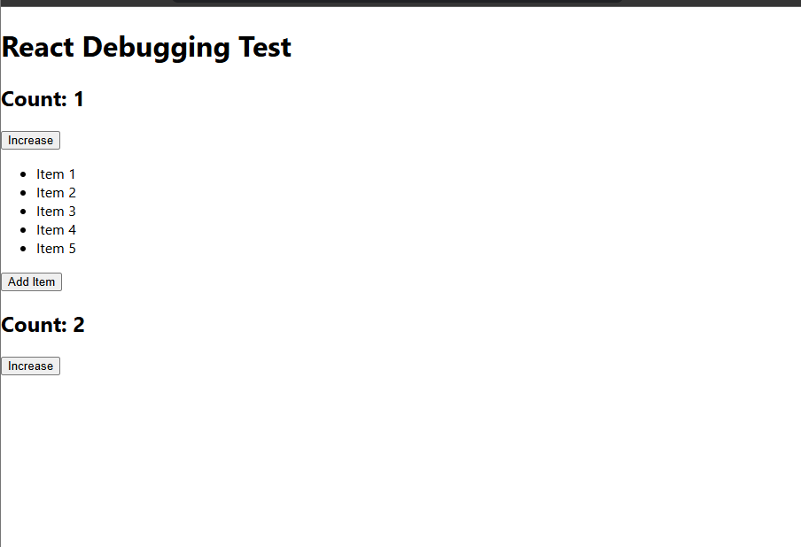

# 🛠 Debugging React: Fixing Common Bugs

## **Bug 1: Mutating State Directly**
**❌ Issue:** Directly modifying state causes unpredictable behavior.  
**✅ Fix:** Use `setState()` with a new reference.

### **Buggy Code**
```jsx
count[0] += 1;
setCount(count); // ❌ React doesn't detect changes
# 🛠 Debugging React: Fixing Common Bugs

## **Bug 1: Mutating State Directly**
**❌ Issue:** Directly modifying state causes unpredictable behavior.  
**✅ Fix:** Use `setState()` with a new reference.

### **Buggy Code**
```jsx
count[0] += 1;
setCount(count); // ❌ React doesn't detect changes
```

### **Fixed Code**
```jsx
setCount([...count]); // ✅ Creates a new reference
```

---

## **Bug 2: Using Index as a Key in Lists**
**❌ Issue:** Index keys can cause incorrect UI updates.  
**✅ Fix:** Use **unique values** instead of the index.

### **Buggy Code**
```jsx
<li key={index}>{item}</li> // ❌ Index key
```

### **Fixed Code**
```jsx
<li key={item}>{item}</li> // ✅ Unique key
```

---

## **Bug 3: Missing Dependency Array in `useEffect`**
**❌ Issue:** `useEffect` runs **on every render** without dependencies.  
**✅ Fix:** Specify dependencies.

### **Buggy Code**
```jsx
useEffect(() => {
  console.log("Count updated:", count);
}); // ❌ Runs on every render
```

### **Fixed Code**
```jsx
useEffect(() => {
  console.log("Count updated:", count);
}, [count]); // ✅ Only runs when count changes
```

---

# ✅ **Final Thoughts**
By **understanding common React bugs**, you can **write cleaner, more predictable code**.  
Use **React DevTools, console logs, and debugging techniques** to improve performance! 🚀

# 🛠 Debugging React: Fixing Common Bugs

## 📷 Screenshot 1 - Issue Observed


## 📷 Screenshot 2 - Fixed Output

