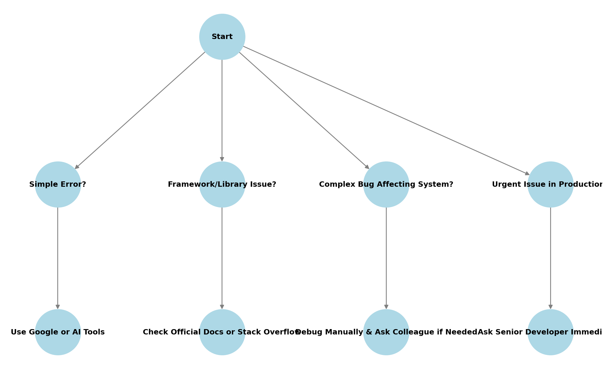

# 🤖 When to Use Google, AI Tools, or Ask for Help?

As developers, we often find ourselves stuck on a bug or struggling to figure out the best way to implement a feature. The big question is:  
**Do we Google it? Ask AI? Or turn to a colleague for help?**  

Knowing when to use each resource can **save time, reduce frustration, and improve productivity**.

---

## 📌 Decision-Making Flowchart  
Here's a simple guide to help decide whether to **Google it, use AI, or ask a colleague**:  

---

## 🧠 When Should You Use AI vs. Google?

### AI (ChatGPT, Copilot) vs Google (Stack Overflow, Docs)

| **Situation**                        | **AI (ChatGPT, Copilot)**                  | **Google (Stack Overflow, Docs)**            |
|--------------------------------------|-------------------------------------------|---------------------------------------------|
| **Small syntax errors**             | ✅ Quick explanations                     | ❌ Too much noise                          |
| **Understanding a new concept**     | ✅ Can summarize easily                   | ✅ Great for official docs                 |
| **Debugging framework/library bugs**| ❌ AI might be outdated                   | ✅ Official docs are more reliable         |
| **Searching for code snippets**     | ✅ AI generates quick solutions           | ✅ Google provides community insights      |
| **Fixing common errors**            | ✅ AI offers instant fixes               | ✅ Google has discussions and more context |

---

### 🌟 **Key Takeaways**

- **AI**: Best for **quick fixes** and **generating solutions**, especially for **common errors** and understanding **new concepts**.  
- **Google**: Best for **detailed solutions**, **official documentation**, and **community insights**.  

---

## 🤝 When Should You Ask a Colleague?

Sometimes, **the best solution is not in Google or AI** but in the **mind of someone on your team**. Here’s when you should consider reaching out to a colleague:  

✅ **If the problem involves company-specific logic** → AI won’t understand internal code structures.  
✅ **If the issue is complex and you’ve already tried debugging** → A second pair of eyes can help.  
✅ **If you’re on a tight deadline** → No time to dig through documentation? Ask someone who’s done it before.  
✅ **If the problem is affecting multiple people** → Fixing it together ensures **everyone benefits**.  

---

## 🚧 What Are the Challenges of Troubleshooting Alone?

- **Too many search results** – Google can overload you with conflicting answers.  
- **Outdated AI responses** – AI-generated solutions might be incorrect or deprecated.  
- **Debugging complexity** – Some problems require hands-on experience to solve.  
- **Wasting too much time** – It’s easy to go down a rabbit hole trying to fix an issue alone.  

### **🔑 The Real Solution?**
Balancing **AI, Google, and human expertise** is the best way to solve coding problems **efficiently and effectively**.  

---

## ✅ Final Thoughts  

No single tool is **always** the best. The real trick is knowing **which one to use and when**. If something is small and fixable, AI is great. If it’s **framework-specific**, Google is the way to go. If it’s **complex and urgent**, don’t hesitate to ask for help!  
  
