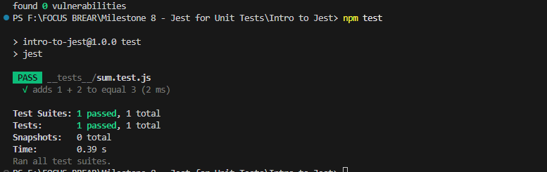

## Reflection on Jest Unit Testing

### Why is automated testing important in software development?
Automated testing ensures the stability of features, reduces regressions, and makes refactoring easier.

### What did you find challenging when writing your first Jest test?
Setting up Jest with Babel was tricky, and understanding matchers like `expect().toBe()` took some practice.

### Jest Project Structure:
Below is the folder structure of the Jest setup:

