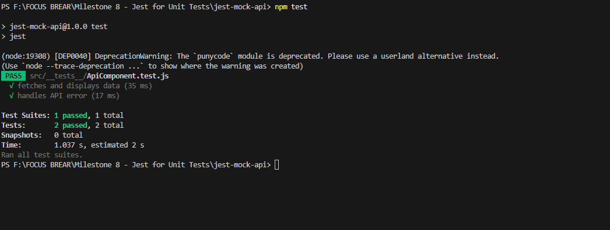

# Reflection on Mocking API Calls in Jest

## Why is it important to mock API calls in tests?
- Ensures tests run **without real network requests**.
- **Prevents failures** due to API downtime.
- **Improves test speed and reliability**.

## What are some common pitfalls when testing asynchronous code?
1. **Not using `await waitFor()`** – Causes flaky tests.
2. **Mocking incorrectly** – Ensure `jest.mock()` is applied before rendering.
3. **Forgetting to restore mocks** – Use `jest.restoreAllMocks()` if needed.

## API Mocking Test Screenshot

Here is a screenshot of the API Mocking test results:

