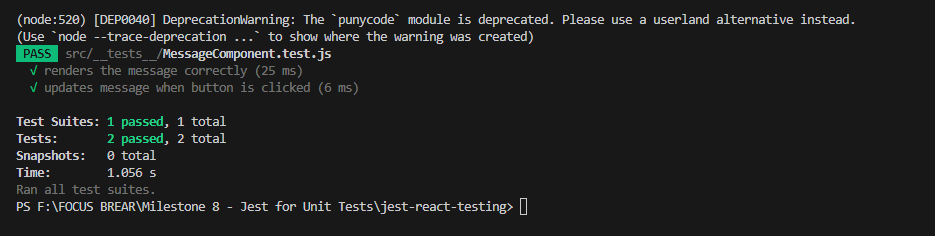

# 📌 Unit Testing with Jest & React Testing Library

## ✅ Overview
This document provides insights into unit testing React components using **Jest** and **React Testing Library**.

## 🎯 Why Use React Testing Library?
React Testing Library is a lightweight testing library designed to test React components in a way that **mimics user interactions** rather than implementation details.

---

## 🛠️ Steps Taken in This Test

### 1️⃣ **Created a Simple React Component**
We built a `MessageComponent.js` file that displays a message.

### 2️⃣ **Set Up Jest & React Testing Library**
Installed the necessary dependencies:
```sh
npm install --save-dev jest @testing-library/react @testing-library/jest-dom babel-jest @babel/preset-env @babel/preset-react
```

### 3️⃣ **Wrote Tests for Component Rendering & User Interaction**
- ✅ Verified that the component renders correctly.
- ✅ Checked if the displayed message updates when interacting.

### 4️⃣ **Ran Tests and Fixed Errors**
We encountered and resolved:
- **Babel parsing errors** (`Unexpected Token`)
- **JSX transformation issues**
- **Jest `jsdom` missing issue**
- **React double import issue**
- **Deprecated methods like `ReactDOMTestUtils.act`**

---

## 📊 Test Results
✅ **All tests successfully passed!** 🎉

### 📸 Screenshot of the Test Results
Here is a screenshot of the test results:



---

## 🔍 **Reflection**
### ❓ What are the benefits of using React Testing Library instead of testing implementation details?
- Focuses on **what the user sees** instead of how components are structured.
- Reduces **false positives** caused by internal refactoring.

### ❓ What challenges did you encounter when simulating user interaction?
- Handling **async state updates** required using `waitFor()`.
- Needed to import the correct methods from `@testing-library/react` to simulate **button clicks**.

---

## 📌 Final Thoughts
Unit testing ensures that React components work as expected in **different scenarios**. By using Jest and React Testing Library, we created **reliable and maintainable tests**.

🚀 **Next Steps:** Expand test coverage by adding tests for **edge cases, accessibility, and error handling**.
