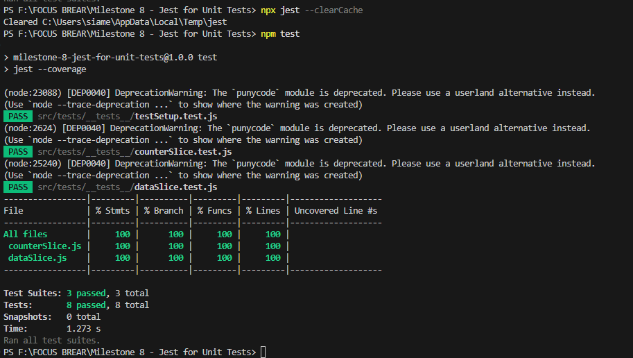

# Unit Tests Reflection

## What was the most challenging part of testing Redux?

The most challenging part of testing Redux was handling **asynchronous actions** (thunks). Unlike synchronous reducers, async actions require mocking API calls and waiting for the response before asserting the state. Using libraries like `redux-mock-store` and `@testing-library/react` helped manage this complexity.

Another challenge was ensuring **proper store setup** during tests. Jest does not automatically configure a Redux store, so it was necessary to create a test-specific store using `configureStore` from Redux Toolkit.

## How do Redux tests differ from React component tests?

Redux tests focus on testing **state changes and actions** independently of UI components. The key differences are:

1. **Redux tests validate state mutations, not UI rendering**:
   - We assert if reducers return the expected state when given an action.
   - We check if dispatched actions trigger the correct state updates.

2. **Component tests validate rendering and user interactions**:
   - React component tests use `@testing-library/react` to simulate user events.
   - Redux tests use `redux-mock-store` to test dispatch and state changes.

3. **Handling async behavior**:
   - Redux tests mock API requests and wait for state updates.
   - React tests use `act()` to ensure UI updates are applied.

## Jest Test Results
The following image shows the successful Jest test results:

